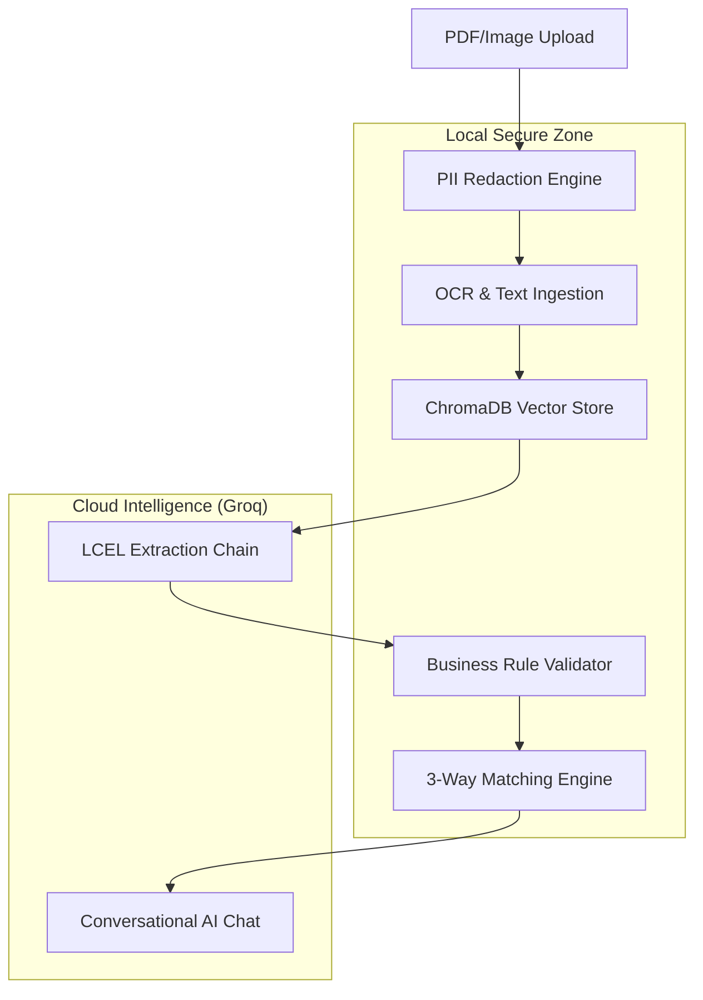

# 🛠️ Technical Architecture & Implementation Details

This document provides a deep dive into the engineering behind the **AI Invoice Assistant**. It covers the architecture, technology stack, and specific developer-led optimizations implemented to ensure enterprise-grade performance and security.

---

## 🏗️ System Architecture
The application follows a **Modular Pipeling Architecture**, ensuring that concerns like Data Privacy, Extraction, and Business Validation are strictly separated.

---

## 🧰 Technology Stack: The "Why"

| Technology | Used For | Why? (The Developer Choice) |
| :--- | :--- | :--- |
| **Groq (Llama 3.1)** | LLM Inference | Chosen for **sub-second latency**. Traditional LLMs take 30s+; Groq provides near-instant extraction for a seamless user experience. |
| **LangChain (LCEL)** | Orchestration | Used **LangChain Expression Language** to build a composable, streaming-friendly pipeline that connects the AI to local functions. |
| **ChromaDB** | Vector Database | Handles **Duplicate Detection** and **Semantic Retrieval**. It ensures notice-of-intent (RAG) by only feeding relevant context to the AI. |
| **Microsoft Presidio** | PII Redaction | Ensures **Security Compliance**. Sensitive data like PAN and Aadhaar are masked *before* any text is sent to the Cloud LLM. |
| **HuggingFace** | Cloud Embeddings | Switched to `all-MiniLM-L6-v2` for cloud deployment to allow the app to run on CPU-only servers without external dependencies. |
| **RapidFuzz** | String Matching | Implemented for **Vendor Reconciliation**, allowing the system to match "HCL Tech" to "HCL Technologies Ltd" accurately. |

---

## 🧠 Key Developer Implementations

### 1. 3-Way Matching Engine (`three_way_matcher.py`)
I developed a deterministic logic engine that reconciles three data points in real-time:
*   **Invoice Data**: Extracted via AI.
*   **Purchase Orders (PO)**: Validated against a master database (Price/Qty check).
*   **Goods Receipt Notes (GRN)**: High-level verification of warehouse acceptance.
*   *Optimization*: Added specific "Rejection Reason" capture to improve AI troubleshooting.

### 2. Business Guardrails (`field_validator.py`)
To prevent "AI Hallucinations," I implemented a layer of hard-coded Python validators:
*   **GST Checksum**: Verifies the 15-digit Indian GSTIN format and state codes.
*   **Arithmetic Audit**: Recalculates `(Subtotal * TaxRate) + Subtotal` to verify the invoice's math.
*   **Status Logic**: Created a cascading status system (`auto_approved`, `needs_review`, `failed`).

### 3. High-Efficiency Cloud Deployment
Optimized the application for **Streamlit Cloud**:
*   **Dependency Management**: Configured `packages.txt` for Tesseract OCR.
*   **Stability**: Pinned Python version to `3.12` and added `pysqlite3-binary` for database stability on Linux servers.
*   **Secret Management**: Implemented `st.secrets` integration to keep API keys encrypted.

---

## 🔒 Data Privacy & Security
*   **Zero-Persistence**: The application is stateless. No invoice data is permanently stored after the session ends.
*   **On-Device Redaction**: All PII masking happens on the local CPU before the AI logic is triggered.

---
**Developer:** [Your Name/GitHub]  
**Project:** AI Invoice Processing Assistant  
**Version:** 2.0 (Accelerated Cloud Edition)
